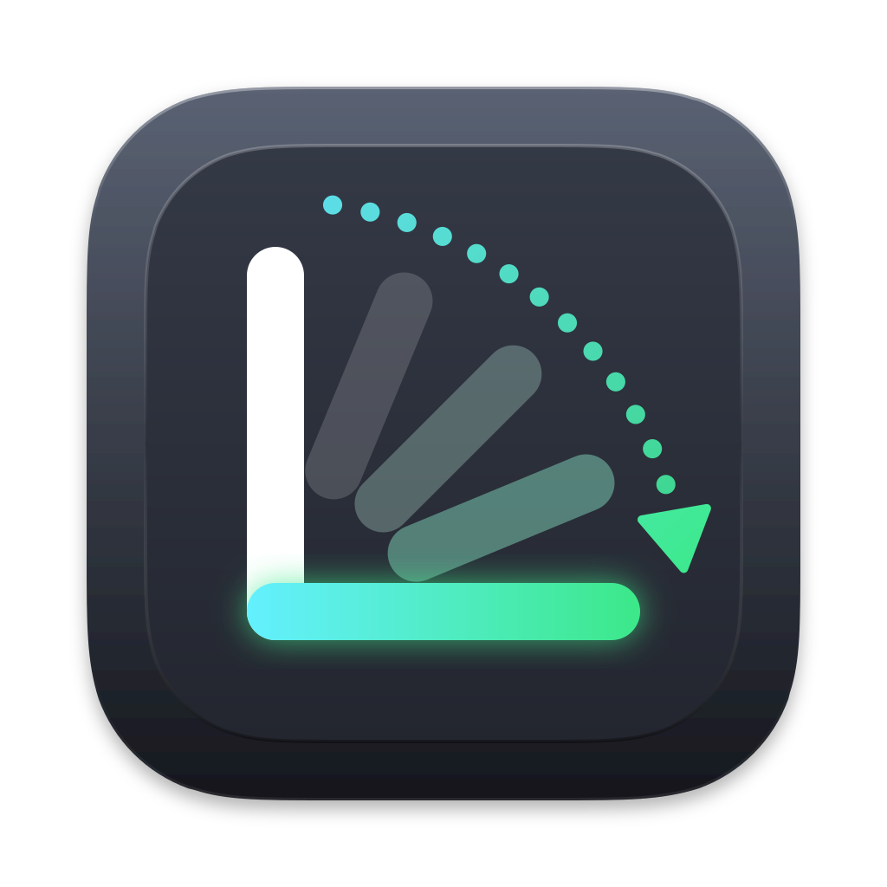
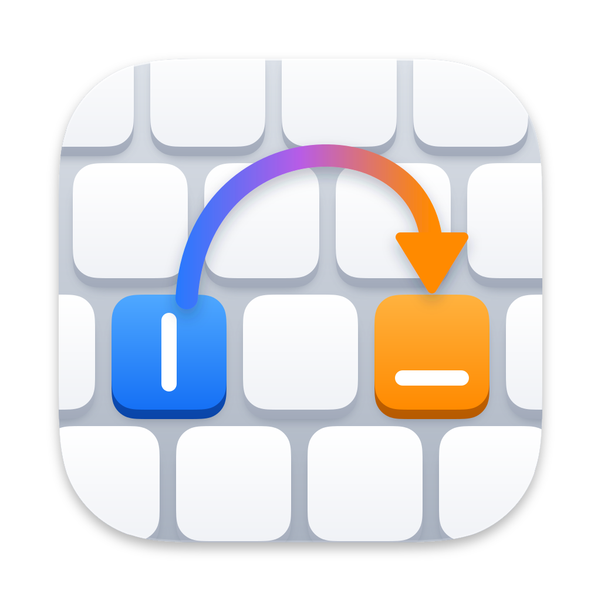
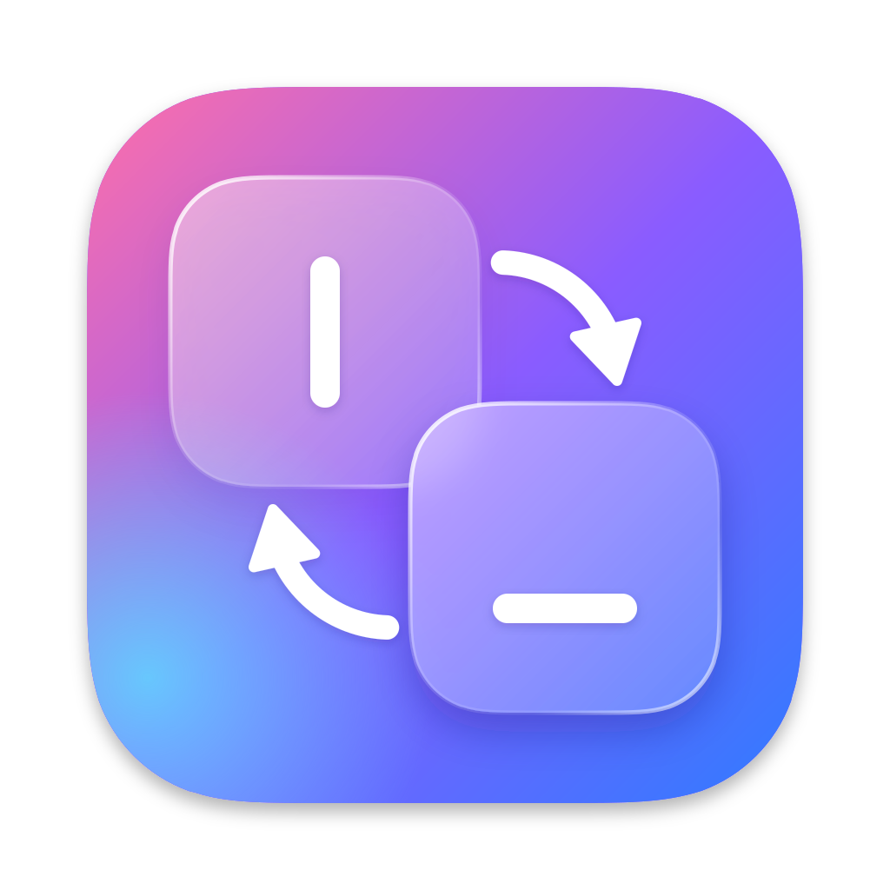
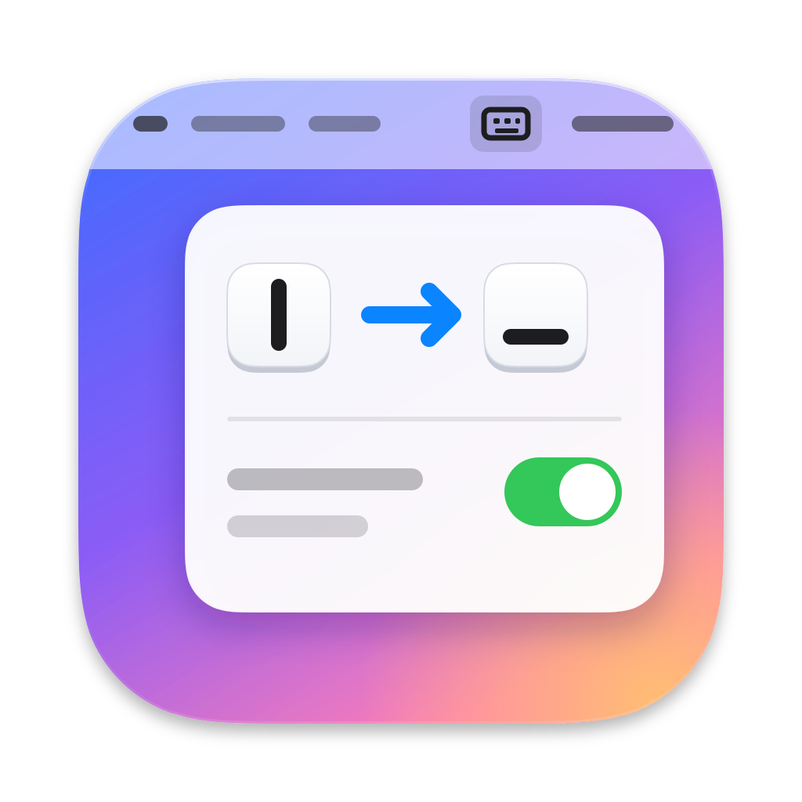

# Propuestas de ícono

Ocho propuestas de ícono para KeySwapo en SVG, con la cuadrícula de los íconos de macOS: lienzo de 1024 × 1024, cuerpo de 824 × 824 con esquinas continuas y la sombra incluida.

|  |  |  |  |
|:---:|:---:|:---:|:---:|
| **1. Intercambio** | **2. Tecla** | **3. Giro** | **4. Teclado** |
|  |  |  |  |
| **5. Tecla partida** | **6. Cristal** | **7. Cable** | **8. Menú** |

1. **Intercambio** ([`1-swap.svg`](1-swap.svg)): las teclas `|` y `_` cambian de lugar.
2. **Tecla** ([`2-keycap.svg`](2-keycap.svg)): una sola tecla grande con ⇄.
3. **Giro** ([`3-turn.svg`](3-turn.svg)): el `|` cae y se convierte en `_`, sobre una tecla oscura vista desde arriba.
4. **Teclado** ([`4-keyboard.svg`](4-keyboard.svg)): en un trozo de teclado, la tecla `|` salta a la `_`.
5. **Tecla partida** ([`5-split.svg`](5-split.svg)): una tecla cortada en dos, con `|` en una mitad y `_` en la otra.
6. **Cristal** ([`6-glass.svg`](6-glass.svg)): dos teclas de vidrio esmerilado que se intercambian, al estilo *Liquid Glass* de macOS 26.
7. **Cable** ([`7-cable.svg`](7-cable.svg)): un cable reconecta la tecla `|` con la `_`, como en una centralita.
8. **Menú** ([`8-menu.svg`](8-menu.svg)): el propio menú de KeySwapo en la barra de menús, con la regla `|` → `_` activada.

Las más simples (1, 2 y 5) son las que mejor se reconocen en tamaños pequeños (16 y 32 px). La 4 y la 8 tienen más detalle y lucen más a partir de 64 px.

## Usar una como ícono de la app

`build.sh` incluye `Resources/Icon/AppIcon.icns` en la app si existe. Para crearlo a partir de una propuesta, en macOS y con `rsvg-convert` (`brew install librsvg`):

```sh
cd Resources/Icon
mkdir AppIcon.iconset
for size in 16 32 128 256 512; do
    rsvg-convert -w $size -h $size Proposals/1-swap.svg -o AppIcon.iconset/icon_${size}x${size}.png
    rsvg-convert -w $((size * 2)) -h $((size * 2)) Proposals/1-swap.svg -o AppIcon.iconset/icon_${size}x${size}@2x.png
done
iconutil -c icns AppIcon.iconset
rm -r AppIcon.iconset
```

Después, `make install` compila la app con el ícono nuevo.
